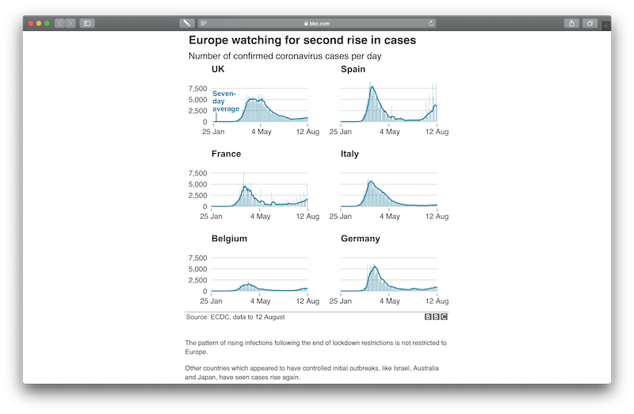

Using Small Multiples to visualise the effect of the coronavirus
pandemic
================
Alex Reppel
30 August 2020

# Personal introduction

My name is Alex Reppel and I am a Reader in Marketing at Royal Holloway,
University of London. My interest in data visualisations is **twofold**.

Firstly, **on a practical level**, exploring numerical data visually
helps me \*\*identify patterns and relationships\*. So, in that sense,
visualisations make data accessible. Data visualisations also make it
easier for me to communicate and discuss what I am seeing in the data
with others.

Secondly, **on a more conceptual level**, I am interested in the
**aesthetic properties** and underlying **design principles** of data
visualisations. Of course, there is some **debate** – as there always is
– about principles in general and what does and what does not constitute
“best practice”. While some authors tend to be more prescriptive than
others, I am **generally intrigued** by these discussions because, for
the observer, **there is almost always something to be learned** when
people disagree.

# Topic introduction

I have chosen a chart that isn’t really one of the basic chart types we
are familiar with. Instead, it is an **arrangement of charts**. It’s
called a **Small Multiple** and it’s essentially a grid of charts of the
same kind.

 *(Source: [The
Guardian](https://www.theguardian.com/world/2020/jul/30/covid-19-england-had-highest-excess-death-levels-in-europe-by-end-of-may))*

Here, we see an example of a small multiple that we will explore in more
detail later on. It clearly shows how charts of the same kind are
arranged in a grid.Although other labels exist, such as “grid chart” or
“panel chart”, I personally prefer the term small multiple because it
**describes the arrangement of charts really well**.

We are essentially taking a **small** version of a chart and
**multiplying** it a number of times based on one or two other
variables. These variables are often categorical, such as the names of
countries, as shown in this example.

The result, then, is a grid of panels that each show a chart of the same
kind, one for each country.

Small multiples are an **intriguing concept** and **my objectives** for
introducing it today are:

1.  First, to expand a little bit more on **the concept itself** and its
    **benefits** …
2.  And second, to **illustrate** small multiples by using examples from
    the beginning of the 2020 coronavirus pandemic.

# Chart type introduction

We have seen before that small multiples are essentially **a grid of
charts** of the same kind.

Edward Tufte (2001, 170), whom I will probably refer to quite a few
times throughout this video, uses the **analogy** of a movie where
charts within the grid resemble movie frames.

This arrangement leads to what Tufte calls “**an economy of
perception**” (Tufte 1990, 29) where “once viewers decode and comprehend
the design for one slice of data they have familiar access to data in
all the other slices.”

Put differently, the “economy of perception” that Tufte associates with
small multiples is the result of **us being able to comprehend the
entire grid** once we have processed – decoded – **one element of it**.

Small multiples come in very **many forms**. They could be drawings,
photographs, collages, or indeed charts. They all have in common that
they, to quote Tufte (1990, 68) again, “reveal, all at once, a scope of
alternatives, a range of options” with **each option** being shown in
one chart within the grid.

**Kieran Healy** (2019, 76), who wrote an excellent introduction on how
to create data visualisations, including small multiples, describes them
as

    a powerful technique ...
    that allows a lot of information
    to be presented compactly
    and in a consistently comparable way 

Drawing these descriptions together, we can conclude that this
**arrangement of charts** allows us to present **a lot of information**
and **compare it consistently** and **efficiently**. Let’s look at a few
examples.

# Case studies

From the beginning of the coronavirus pandemic in 2020, small multiples
were used to compare outbreaks across countries.

## Example \#1: BBC

 *(Source:
[BBC](https://www.bbc.co.uk/news/world-51235105))*

The example you see here is from the BBC website. This graph shows the
number of confirmed cases for **six European countries** between March
and August 2020. Daily numbers are shown as light blue bars, with a
thicker line indicating the average number of cases over the previous
seven days. We can see that **the vertical axis** – or *Y-axis* – is
**fixed**. This means that the same values are used to scale each chart.
In this example, the vertical axis for each of the six charts goes from
0 to 20,000.

This makes it easy to **compare changes across these six countries**. We
can see, for example, that cases in Spain and France are rising fast,
and that the number for Belgium is considerably lower compared to those
for the other five countries.

This is not surprising because what we are seeing are **absolute numbers
of cases**, not the number of cases relative to the population of each
country. This is an important consideration, given that the population
of the UK is almost six times larger than the population of Belgium, and
Germany more than seven times larger.

One option to compare the numbers for all six countries would be to show
cases relative to the size of the population, such as in “Number of
cases per 100,000 people”. But even without this information, this small
multiple from the BBC **clearly shows an increase in numbers for some
countries**, which is *insightful* and does encourage us to **ask
further questions**, such as whether the increase in cases **is
distributed evenly within these countries** or limited to so called “hot
spots”. As a result, this visualisation **creates awareness**, which in
itself is an important contribution data visualisations can make.

## “Three ways to measure UK deaths”

Another way to analyse the devastating impact this pandemic had during
the first half of 2020, is to look not only at the number of cases, but
also at **the number of casualties**.

 *(Source:
[BBC](https://www.bbc.co.uk/news/uk-51768274))*

Here, we see a diagram – again from the BBC website – that explains the
different ways in which UK deaths related to coronavirus can be
measured. The third way – shown here at the bottom – is to **compare**
the number of cases over a given period of time with the number of cases
**we would expect for that period** based on the average over the
previous five years.

## Example \#2: The Guardian

 *(Source: [The
Guardian](https://www.theguardian.com/world/2020/jul/30/covid-19-england-had-highest-excess-death-levels-in-europe-by-end-of-may))*

This way of measuring mortality – often referred to as “**excess
deaths**” or “**excess mortality**” – is shown in this example of a
small multiple from The Guardian. This is an interactive graph that
reveals additional detail when we move over certain areas of the graph.
Interactivity invites exploration and engagement with the underlying
data.

In terms of visual representation, we see a grey dotted line and a red
area. The grey dotted line indicates the average number of deaths that
have occurred over the past five years. Typically, we would expect
numbers for 2020 to be close to that line.

The difference between the actual numbers for 2020 and the expected
numbers based on a five year average is shown in red. This red area
highlights “excess mortality”. The related technical term for this
feature is “preattentive pop-out”, which Healy (2019, 19–20) describes
as “mak\[ing\] some things on a data graphic easier to see or find than
others.”

Contrary to the previous example from the BBC website, the vertical axis
– the **y-axis** – is **not fixed** and shows **different numbers** for
each nation. This is referred to as a **free scale**.

Hadley Wickham (2016, 151), from whom we will hear much more when we
create our own chart, says that

    Fixed scales make it easier to see patterns across panels;
    free scales make it easier to see patterns within panels.

Using a free scale for the vertical axis means that it is **slightly
more difficult** to compare the **total number of cases** across the
four UK nations, but **easier** to compare **their development over
time** for each country. We see, for example, that the **slope of the
curve for Scotland** differs from that of the other three nations, where
we see another brief increase around week 18.

## Example \#3: Financial Times

 *(Source: [Finanical
Times](https://www.ft.com/content/a26fbf7e-48f8-11ea-aeb3-955839e06441))*

The last example I would like to show you is a small multiple developed
by John Burn-Murdock for the Financial Times. This chart allows us to
compare excess deaths **across many countries** at the beginning of the
2020 outbreak.

Compared to the previous two examples, this chart is considerably **more
complex**. But when one takes the time to explore it, the “**economy of
perception**” that Tufte associates with small multiples becomes
obvious. Similar to the previous example from The Guardian, the vertical
axis – the y-axis – is **not fixed**, which, again, makes it easier to
**compare the shape** of each line graph.

This version also takes into account **differences in terms of data
availability**. For example, we can see that the latest data available
for the UK is June 26th, while the latest data available for Italy is
April 29th.

Overall, this example of a small multiple manages to put **a lot of
information** into a single graph, while still being readable.

# Conclusion

This last example from the Financial Times demonstrates very clearly the
“**economy of perception**” that Tufte associates with small multiples.
It demonstrates – in an elegant way – that this form of visualisation is
particularly useful when we want to present a lot of information and to
compare that information consistently and efficiently.

In a second part in this series on small multiples, I am going to
demonstrate how you can create a graph using R and a library called
**ggplot2** (Wickham 2016). The example graph we will create shows the
2020 mortality rates for England and Wales across different age groups.

As you can see, the example we will be developing contains a number of
customizations that were inspired by the small multiple developed by
John Burn-Murdock for the Financial Times. The **ggplot2** library makes
the creation of a graph easy, and the customisations based on an
existing example adds a little extra challenge to the task. But, as we
will see, even that can be accomplished using **ggplot2**.

Thank you very much for watching and I hope to see you soon for the
second video in this series.

# References

Healy, Kieran. 2019. “Data Visualization: A Practical Introduction.” In.
Woodstock: Princeton University Press.

Tufte, Edward R. 1990. *Envisioning Information*. Cheshire, CT: Graphics
Press.

———. 2001. *The Visual Display of Quantitative Information*. Cheshire,
CT: Graphics Press.

Wickham, Hadley. 2016. *Ggplot2: Elegant Graphics for Data Analysis*.
Berlin: Springer.

