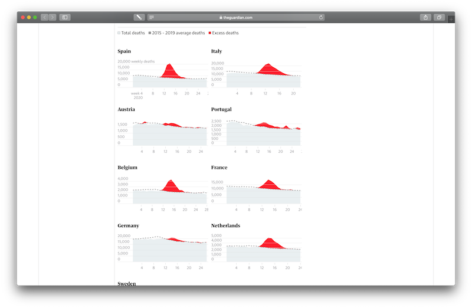
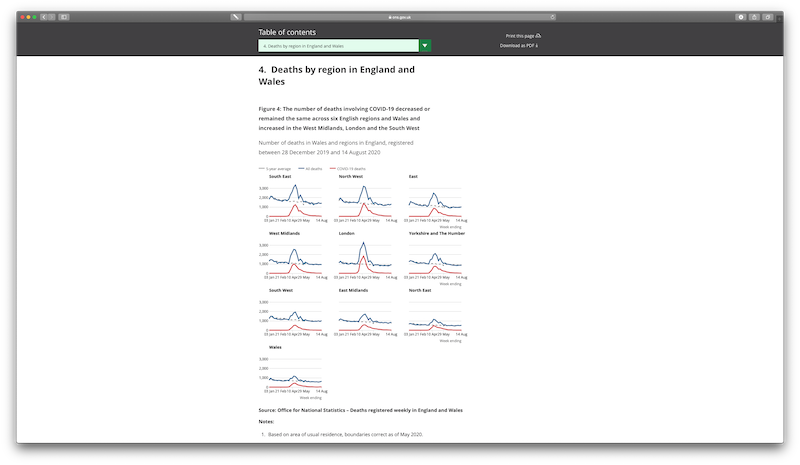

```{r setup, include=FALSE}
knitr::opts_chunk$set(echo = TRUE)
knitr::opts_chunk$set(fig.path='assets/export/')
knitr::opts_chunk$set(
  fig.width = 10,
  fig.asp = 1,
  out.width = "100%"
)
```


# Introduction

In the previous part of this series, we learned that [small multiples](https://www.edwardtufte.com/bboard/q-and-a-fetch-msg?msg_id=0000hv) are particularly useful to present large amounts of information "**compactly** and in a **consistently comparable way**" [@Healy:2019aa, 76, emphasis added]. In this follow-up, I am going to demonstrate how to create a small multiple using [R](https://www.r-project.org/) and the **ggplot2** library [@Wickham:2016aa].

At the beginning of the 2020 coronavirus pandemic, small multiples were frequently used to visualise the impact the pandemic had in different countries. Below is a collection of examples from (top left to bottom right): The [BBC](https://www.bbc.com/news/world-51235105), [The Guardian](https://www.theguardian.com/world/2020/jul/30/covid-19-england-had-highest-excess-death-levels-in-europe-by-end-of-may), [The Financial Times](https://www.ft.com/content/a2901ce8-5eb7-4633-b89c-cbdf5b386938), [The Scottish Parliament](https://spice-spotlight.scot/2020/06/19/excess-deaths-in-scotland/), [The Times](https://www.thetimes.co.uk/article/curfew-threat-to-stop-virus-bwnst6nrq), and the [ONS](https://www.ons.gov.uk/peoplepopulationandcommunity/birthsdeathsandmarriages/deaths/bulletins/deathsregisteredweeklyinenglandandwalesprovisional/weekending14august2020).

{width=33%}
{width=33%}
{width=33%}
{width=33%}
{width=33%}
{width=33%}

Several of these examples compare *mortality rates* across countries. One of them, [John Burn-Murdock](https://twitter.com/jburnmurdoch)'s small multiple of [mortality rates for different countries](https://www.ft.com/content/a2901ce8-5eb7-4633-b89c-cbdf5b386938), is a particularly impressive example of how a carefully designed small multiple makes complex data accessible. Part of its appeal are the customisations and instructive annotations that were added to the graph.

{width=75%}


## Aim

Collecting mortality data across countries is difficult and we are not attempting to replicate that in this exercise. Instead, we will create a small multiple that compares *mortality rates* for England and Wales across different age groups using [R](https://www.r-project.org/) and the **ggplot2** library [@Wickham:2016aa]. As an additional challenge, my aim is to reproduce some of the aesthetics, as well as the overall visual appeal of [John Burn-Murdock](https://twitter.com/jburnmurdoch)'s small multiple of [mortality rates for different countries](https://www.ft.com/content/a2901ce8-5eb7-4633-b89c-cbdf5b386938).


## Acknowledgements

Good data visualisations depend on good data. For this exercise, I used data from the UK's [Office for National Statistics](https://www.ons.gov.uk/peoplepopulationandcommunity/birthsdeathsandmarriages/deaths/articles/comparisonsofallcausemortalitybetweeneuropeancountriesandregions/januarytojune2020). 

This, then, brings me to the first code snippet. Here, we create a variable called `acknowledgements` to store a number of acknowledgements that will later appear at the lower right corner of the graph. 

```{r}
acknowledgements <- c(
    "Data: Office for National Statistics licensed under the Open Government Licence.",
    "Created by AR using R and ggplot2. Aesthetics inspired by John Burn-Murdock / FT.",
    "Reference: Wickham H. (2016). ggplot2: Elegant Graphics for Data Analysis, 2nd ed., New York: Springer.")
```


# Customisation

There are a couple of additional variable required for the graph, such as an appropriate `title`.

```{r}
title <- "Weekly provisional figures on deaths registered in England and Wales."
```

Earlier, I said that, as an additional challenge, we will try to reproduce some of the design aesthetic of an existing visualisation, which means we should specify a couple of customisation options that we only have to specify once, but that will be used in code blocks through this exercise.

These are:

1. A subtitle that allows us to highlight individual words
2. The ability to highlight specific weeks in the final graph
3. A custom colour scheme


## Highlight individual words in the subtitle

We will use the subtitle of the final graph as a replacement for a more traditional legend that assists viewers in decoding the final graph.

This unwieldy line stores the text "*Weekly cases by age group for 2020 compared to the historic average between 2010 and 2019*" into the `subtitle` variable.

```{r}
subtitle <- "Weekly cases by age group for <b style='color: %s'>%d</b> compared to the <b style='color: %s'>historic average</b> between <b style='color: %s'>%d</b> to <b style='color: %s'>%d</b>."
```

The text contains some [HTML](https://en.wikipedia.org/wiki/HTML) code to highlight individual words, three placeholders (indicated by a `%d`) for dates, and another four placeholders (indicated by a `%s`) for colour labels.

Using HTML formatting and placeholders in the text allows us to (a) highlight individual words and (b) to insert years and colour names dynamically later on. (The technical term for this technique is called [string formatting](https://stackoverflow.com/questions/46085274/is-there-a-string-formatting-operator-in-r-similar-to-pythons).) 


## Highlight individual weeks

Another customisation we will do later on is to highlight individual weeks on the x-axis. The variable `highlight_weeks` contains the numbers of the four weeks that will be shown on the x-axis in the final graph (with the dates corresponding to each week):

1. Week 1, beginning Monday, 30. December 2019
2. Week 13, beginning Monday, 23. March 2020
3. Week 27, beginning Monday, 29. June 2020
4. Week 53, beginning Monday, 28. December 2020

```{r}
highlight_weeks <- c(1, 13, 27, 53)
```


## Specify a colour scheme

The last customisation we have to specify is a colour scheme. **ggplot2** offers a wide variety of themes and colour schemes, so this is yet another step that isn't really required to create an attractive graph. I am adding it here in an attempt to replicate the visual appeal of [John Burn-Murdock](https://twitter.com/jburnmurdoch)'s small multiple of [mortality rates for different countries](https://www.ft.com/content/a2901ce8-5eb7-4633-b89c-cbdf5b386938).

```{r}
# Current year
highlight_colour = "#C11B17"
# Previous years
historic_colour = "#343434"
# Background fill
background_colour = "#FFF5EE" # "SeaShell"
# Horizontal and vertical lines
grid_colour = "#FFF9F5"
# Main title
title_colour = "#0C090A" # "Night"
# Subtitle, caption, and axis labels
label_colour = "#5C5858" # "Gray Dolphin"
```


# Setup

Before we can begin crating a graph, we have to load a couple of packages that provide **R** with the necessary capabilities. We also have to load our data file.


## Packages

This exercise uses **ggplot2**, which is part of [tidyverse](https://www.tidyverse.org), a collection of several useful packages.

[tidyverse](https://www.tidyverse.org) is not part of the default R installation and needs to be installed separately.

To be able to customise the `subtitle` with HTML formatting, we also need to install [ggtext](https://github.com/wilkelab/ggtext). (In the code snippet below, the commands to load both packages are commented out. Remove the "#" sign in front of each line to install each package.)

```{r Install packages, message=FALSE, warning=FALSE}
# install.packages("tidyverse")
# install.packages("ggtext")
```

Once installed, required packages can be loaded using the `library()` function.

```{r Load packages, message=FALSE, warning=FALSE}
library(tidyverse)
library(ggtext)
```


## Data files

The data file extracted from the **ONS** data is stored as [comma-separated values](https://en.wikipedia.org/wiki/Comma-separated_values) and needs to be read into a variable.

The place where **R** can find the data file is the only argument required by the `read.csv()` function. The file is called `small_multiples_data_age_EW.csv` in the `_assets/_data/` directory.

We add two more useful arguments this function: (a) to specify that column names should be left untouched (`check.names = FALSE`) and (b) that empty cells should be treated as missing values or `NA`s, so that **R** knows that these values are missing (`na.strings = ""`).

```{r}
data <- read.csv(
  "assets/data/small_multiples_data_age_EW.csv",
  check.names = FALSE,
  na.strings = "")
```

We can confirm that the data was successfully loaded by using the `tail()` function, which displays the last couple of rows of the data set.

```{r}
tail(data)
```

Using the `tail()` function confirms that the data has been loaded successfully and that it is stored as expected, with the six age groups used as column labels.


# Data manipulation

Some additional *data wrangling* [@Sterling:2005aa] is required to convert the data set into a format that the **ggplot2** library can understand:

1. convert dates from text into date objects
2. 'tidy' the data set
3. create custom labels for the x-axis


## Dates

Dates are currently stored as text strings, but it'll be much easier to work with dates as `date object`, or objects where **R** knows that it is working with dates. 

The following code tells **R** that the `DATE` column contains dates in the form `DD/MM/YYYY`. The `data$DATE` command is shorthand for "select the entire `DATE` column in the `data` data set".

```{r}
data$DATE <- as.Date(
  data$DATE,
  format = "%d/%m/%Y")  # e.g. "26/08/2020"
```

Once dates are converted into date objects, **R** knows what to do with them. We can, for example, move each individual date stored in our data set back four days:

```{r}
data$DATE <- data$DATE - 4  # Move four days back to the beginning of the week.
```

I am doing this to highlight how easy it is to manipulate dates in **R**. But there is also a practical reason for moving the date to the beginning of the week. The ONS data labels weeks by the date of the Friday, or the end, of that week. By subtracting four days, we arrive at the Monday of the same week.

While not strictly necessary, it demonstrates the flexibility we have in terms of manipulating data within **R**, as opposed to changing date labels manually in a spreadsheet programme for example. (However, it is also important to acknowledge that the adjustment made here changes the reference to the data in the **ONS** data set, which may not be appropriate. These changes are made for illustrative purposes.)


## 'Tidy' the data set

The original data set from the **ONS** and the data set I created from it store some relevant values in columns., such as the six `Age Groups`. This format is often referred to as "*wide*", as opposed to a "*long*" format where all values are stored in rows and no values are stored in columns. While I find "wide" data much easier to read or work with manually, **ggplot2** disagrees and prefers data stored in "long" format, which is also known as "*tidy*" format.

The following code, adapted from Wickham and Grolemund [-@Wickham:2017aa, p. 153] converts our data set from a "wide" format into "long" or "tidy" format:

```{r}
data <- data %>%
  gather(
    `14 years or younger`,
    `15 to 44 years`,
    `45 to 64 years`,
    `65 to 74 years`,
    `75 to 84 years`,
    `85 years or more`,
    key = "AGE_GROUP",
    value = "CASE_COUNT")
```

We can confirm this by listing some of the rows in the now "tidy" data set. Here, we list five rows, starting at row 3,392:

```{r echo=FALSE, message=FALSE, warning=FALSE}
data[3392:3396,]
```

We can see that the different age groups were successfully into a "tidy" format that **ggplot2** likes.


## Identify current, previous, and first year

Many of the examples shown at the beginning of this tutorial compare mortality rates for 2020 with the average rates of previous years (typically the average over the past five years). This is an effective way to inform citizens about the impact of the pandemic.

We aim for something similar in this example, which requires us to distinguish data for the current year, previous years, and also for the first year in the data set. (These variables will be used in subsequent code blocks and to customise the `subtitle`.)

Identifying the current, previous, and first year in the data set is straightforward by locating either the highest values (using the `max()` function), or the lowest value (using the `min()` function) in the data set.

```{r}
current_year <- max(data$YEAR)
```


```{r}
previous_year <- max(data$YEAR[data$YEAR != current_year])  # != translates into "is not equal to"
```


```{r}
first_year <- min(data$YEAR)
```


## Labels (x-axis)

For this example, it is desirable to use actual dates as x-axis labels instead of listing the number of weeks.

The following code block looks intimidating, but really all it does is create a subset from our data that is restricted to the current year and the weeks we said we want to highlight in the final graph (which we had previously stored in the `highlighted_weeks` variable).

From this subset, all the `unique()` dates are extracted from the `DATE` column. The result is a list of dates from the current year that correspond with the list of weeks we want to highlight.

```{r}
dates <- unique(
  subset(
    data,
    YEAR == current_year & WEEK %in% highlight_weeks)$DATE)
```

We then assign that list of dates as names to the `highlight_weeks` variable. Because we previously converted dates into date *objects*, we can now change the way dates are displayed with the `format()` function.

```{r}
names(highlight_weeks) <- format(dates, "%d\n%b")
```


## Current and historic data

The previous data manipulation steps were applied to the entire data set.

The next ones require a distinction between `current` data (i.e., data from the most recent year) and `historic` data (i.e., data from previous years).

```{r}
current <- subset(data, YEAR == current_year)
```


```{r}
historic <- subset(data, YEAR < current_year)
```


## Historic average

While not particularly elegant, splitting the data into two separate data sets is a pragmatic way to be able to create the average of data from previous years.

The first step is to calculate the average (`mean`) of values for each `WEEK` and `AGE_GROUP` of the `historic` data set. Results are stored in a new variable called `historic_average`.

```{r}
historic_average <- aggregate(
  CASE_COUNT ~ WEEK + AGE_GROUP,
  FUN = mean,
  data = historic)
```

Looking at the variable `historic_average`, we can see that it is a table of averages for each of the age groups and weeks.

```{r}
tail(historic_average)
```

Another fairly complicated looking line changes the label of the third column from `CASE_COUNT` to `HISTORIC_AVERAGE`.

```{r}
names(historic_average)[names(historic_average) == "CASE_COUNT"] <- "HISTORIC_AVERAGE"
```

Having changed the label, we can now move on to merge the column `historic_average` into the `current` data set.

```{r}
current <- merge(
  current,
  historic_average,
  by = c("WEEK", "AGE_GROUP"),
  all = TRUE)
```

This helps create another column in the `current` data set called `YMIN`. This column contains the *minimum value* for each week of either the current year or the `historic_average`. (You will see later that this is used to determine the *floor* of the area plot for each week; otherwise, the area plot would fill the entire area down to the x-axis, which is not what we want.)

```{r}
current["YMIN"] <- apply(
  cbind(
    current$CASE_COUNT,
    current$HISTORIC_AVERAGE),
  1, min, na.rm = TRUE)
```


# The graph

We are now ready to generate the graph.


## Base layer

In *ggplot2*, a graph is initiated with the `ggplot()` function. The following code specifies to use the `historic` data set as its default and to show `WEEK`s on the x-axis and `CASE_COUNT`s on the y-axis.

```{r}
figure <- ggplot(
  data = historic,
  mapping = aes(
    x = WEEK,
    y = CASE_COUNT,
    group = as.factor(YEAR))
  )
```

What makes **ggplot2** to easy to use is its notion of *layers*. Having initialised the base layer above, we can now begin building our graph by adding additional layers to it.

But first, I would like to add the title, subtitle, and caption to our base layer.


### Labels

Adding labels to a graph is straightforward in **ggplot2**. Unfortunately, the customisation I want to add makes this process a little more complicated, because we first have to prepare the `subtitle` and `caption` text.

Remember the `subtitle` variable at the beginning of this exercise?

```{r echo=FALSE}
subtitle
```

By using a combination of *string formatting* and *HTML code*, we can create a subtitle in lieu of a legend.

```{r}
subtitle <- sprintf(
  subtitle,
  highlight_colour,
  current_year,
  historic_colour,
  historic_colour,
  first_year,
  historic_colour,
  previous_year
  )
```

Using the `sprintf()` function, we swap the placeholders `%s` (text strings) and `%d` (dates) with variables from our data set. Each placeholder corresponds with the parameter of the function. (Example: The first `%s` in `subtitle` is replaced by the value stored in `highlight_colour`.)

We can confirm that everything worked well by printing the `subtitle` variable after formatting:

```{r echo=FALSE}
subtitle
```

This is exactly what we wanted. Because we have loaded the `ggtext()` library, this will later interpret the HTML code when adding the text to the graph.

Similarly, we have previously stored acknowledgements in the `acknowledgements` variable, which consists of several items.

```{r echo=FALSE}
acknowledgements
```

Before we can add that text to the graph, we have to "glue" each item together into a single text string.

We do that by converting our list of acknowledgements into a text string using the `paste()` function. The odd-looking argument `collapse = "\n"` tells it to join each items together with a new line character in between (`\n` is the so called [espace sequence](https://en.wikipedia.org/wiki/Escape_sequence) representing a "line break" or "[newline](https://en.wikipedia.org/wiki/Newline)").

By separating each item with a "new line", the caption runs over several lines, which looks much better than trying to put all that text into a single line.

```{r}
caption <- paste(
  acknowledgements,
  collapse = "\n")
```

We can now add the title, subtitle, and caption to the graph. **ggplot2** makes that very easy with concatenation where something is added (using the `+` operator) to the existing graph object (stored in the `figure` variable).

```{r}
figure <- figure +
  labs(
    title = title,
    subtitle = subtitle,
    caption = paste(
      acknowledgements,
      collapse = "\n")
    )
```

Printing the graph shows an empty frame, which is as it should be because we haven't yet specified any data to be put on top of it!

```{r echo=FALSE, message=FALSE, warning=FALSE}
figure
```


### Facet wrap

Before we add data to the frame, we convert it into a **small multiple**.

This step demonstrates the power of **ggplot2** probably more than any of the previous or subsequent steps.

This exercise began with the challenge of producing aesthetically pleasing small multiples. To do that in **ggplot2**, all that is required is the `facet_wrap()` function with three arguments:

1. The variable used to distinguish individual graphs
2. The number of rows used to organise individual graphs
3. Whether the same or different scales should be used for each graph

Once again, we add that to our existing graph object.

```{r}
figure <- figure +
  facet_wrap(
    ~ AGE_GROUP,
    nrow = 2,
    scales = "free"
    )
```

We use `AGE_GROUP` to separate the graph into six smaller graphs, arranged across two rows (`nrow`), with each individual graph using their own scale. (In reality, this only applies to the y-axis, because all six graphs use the same values for the x-axis).

```{r echo=FALSE, message=FALSE, warning=FALSE}
figure
```


## Additional layers

Now that we have established the frame for our small multiple, we can begin adding data to it.

Once again, the beauty of **ggplot2** is the clarity which which graphs are build. It applies a "*layered grammar of graphics*", which means that a graph can be thought of as a collection of layers, each one drawn over the previous one.

Without elements of subsequent layers printed over them, those of previous layers remain visible. The use of transparency offers further possibilities to keep them visible.


### Layer 1

The first layer shows historic data as a series of line graphs. Each line represents the number of weekly cases for one year between 2010 and 2019.

```{r}
figure <- figure +
  geom_line(
    colour = historic_colour,
    alpha = 0.1) # opacity level of 10%
```

The way lines are arranged does not allow for a direct comparison of historic data. An obvious way to enable this would be to draw each line in a different colour, thus considerably increasing the visual complexity of the resulting graph.

But this is not what we are interested in here. Instead, we can broadly see whether cases have fluctuated over the years, which is what we want.

```{r echo=FALSE, message=FALSE, warning=FALSE}
figure
```


### Layer 2

The second layer shows the *average of weekly cases* over all the previous years (i.e., between 2010 and 2019).

The average is once again shown as a line graph, although this time with a thicker line and considerably less opacity.

```{r}  
figure <- figure +
  geom_line(
    data = current,
    mapping = aes(
      x = WEEK,
      y = HISTORIC_AVERAGE),
    size = 1,
    colour = historic_colour,
    alpha = 0.8)
```


```{r echo=FALSE, message=FALSE, warning=FALSE}
figure
```


### Layer 3

One of the most interesting and powerful aspects of the original inspiration for this exercise, [John Burn-Murdock](https://twitter.com/jburnmurdoch)'s small multiple of [mortality rates for different countries](https://www.ft.com/content/a2901ce8-5eb7-4633-b89c-cbdf5b386938) is the use of a shaded area indicating [total excess deaths during the outbreak](https://www.ft.com/content/a2901ce8-5eb7-4633-b89c-cbdf5b386938).

While our example aims to replicate this feature in principle, we are much less ambitious: Instead of a shaded area during a specific period, such as the period of the current pandemic, a shaded area is shown for every week where the cases in 2020 are above the historical average.

We draw this area by specifying maximum and minimum values for the y-axis. The maximum value is always the value for the current year. The minimum value is either the value for the current year or that of the historic average, whatever is lowest (we have already calculated these values and stored them in the `YMIN` column).

This ensures that only the area between the current value and historic average is filled, and only if the current value is higher than the historic average.

```{r}
figure <- figure +
  geom_ribbon( # Used to create a filled area
    data = current,
    mapping = aes(
      x = WEEK,
      ymin = YMIN,
      ymax = CASE_COUNT),
    fill = highlight_colour,
    alpha = 0.25)
```


```{r echo=FALSE, message=FALSE, warning=FALSE}
figure
```


### Layer 4

The fourth layer is added for visual effect, once again inspired by [John Burn-Murdock](https://twitter.com/jburnmurdoch)'s [original](https://www.ft.com/content/a2901ce8-5eb7-4633-b89c-cbdf5b386938).

This layer draws a white line above the area graph of the previous layer. The line size is slightly thicker than the layer that will be added next, which creates a pleasing visual effect of a subtle white shadow underneath the actual line for the current year.


```{r}   
figure <- figure +
  geom_line(
    data = current,
    mapping = aes(
      x = WEEK,
      y = CASE_COUNT,
      group = as.factor(YEAR)),
    size = 2,
    colour = background_colour,
    alpha = 0.8)
```

```{r echo=FALSE, message=FALSE, warning=FALSE}
figure
```


### Layer 5

All that is now missing is a line graph for the `current` year. This is drawn on top of the previous white line. The result gives the impression that layers 3-5 form a visual entity, a filled area chart with a distinct outer line and a subtle white shadow underneath.

```{r}   
figure <- figure +
  geom_line(
    data = current,
    mapping = aes(
      x = WEEK,
      y = CASE_COUNT,
      group = as.factor(YEAR)),
    size = 1, # should be lower than the value of the previous line geom
    colour = highlight_colour, # should be different from the colour of the previous line geom
    alpha = 0.8)
```


```{r echo=FALSE, message=FALSE, warning=FALSE}
figure
```


### Layer 6

The final layer is yet another one added for aesthetic reasons. It is a straight horizontal line that meets the y-axis at point zero.

The line provides the lower end of the graph, which increases the visual appeal of the graph when plotted as small multiples.

```{r} 
figure <- figure +
  geom_hline(
    yintercept = 0, # intercept the y-axis at point 0
    colour = label_colour,
    alpha = 0.8,
    size = 1)
```


```{r echo=FALSE, message=FALSE, warning=FALSE}
figure
```


## Themes

The graph is now ready. **ggplot2** provides a number of attractive [themes](https://ggplot2-book.org/polishing.html) to ensure visual consistency and to enhance the visual appeal of the final output.


### A build-in theme

The graph below uses the `theme_minimal()` function, one of the default themes available in **ggplot2**.


```{r echo=FALSE, message=FALSE, warning=FALSE}
figure + theme_minimal()
```


### Customised theme

However, replicating the original inspiration as closely as possible requires a custom theme. While customising a theme is straightforward and very well explained in [@Wickham:2016aa], this step can take some time to get right.

```{r}
figure <- figure +
  theme(
    # Plot
    plot.background = element_rect(
      fill = background_colour),
    plot.margin = margin(
      0, 30, 20, 20),
    # Title
    plot.title = element_text(
      margin = margin(
        20, 0, 0, 0),
      size = 20,
      colour = title_colour,
      face = "bold",
      hjust = 0),
    plot.title.position = "plot",
    # Subtitle
    plot.subtitle = element_markdown(
      size = 14,
      colour = label_colour,
      margin = margin(
        5, 0, 10, 0),
      hjust = 0),
    # Caption
    plot.caption = element_text(
      size = 12,
      colour = label_colour,
      margin = margin(
        10, 0, 0, 0),
      hjust = 1),
    plot.caption.position = "plot",
    # Legend
    legend.position = "none",    
    # x and y-axis
    axis.ticks.length = unit(5, "pt"),
    # x-axis
    axis.title.x = element_blank(),    
    axis.text.x = element_text(
      size = 10,
      colour = historic_colour),
    # y-axis
    axis.title.y = element_blank(),    
    axis.text.y = element_text(
      size = 12,
      colour = historic_colour),
    axis.ticks.y = element_blank(),
    # Panels (within the grid)
    panel.background = element_rect(
      fill = background_colour),
    panel.spacing = unit(25, "pt"),
    panel.grid.major = element_line(
      color = grid_colour,
      size = 0.5),
    panel.grid.minor = element_blank(),
    strip.background = element_rect(
      fill = background_colour),
    strip.text = element_text(
      size = 12,
      colour = title_colour,
      face = "bold",
      hjust = 0,
      margin = margin(
        20, 0, 10, 0)
      ),
    )
```


```{r echo=FALSE, message=FALSE, warning=FALSE}
figure
```


## Scales

What is still missing are customised scales for both axis. We begin by replacing the labels on the x-axis that **ggplot2** has chosen for us. 


### X-axis

Instead of default labels, we use dates for the weeks as listed in the variable `highlight_weeks`. The following code block tells **ggplot2** to scale the x-axis from zero to the last available, i.e. the last week available in our data set.

```{r}  
figure <- figure +
  scale_x_continuous(
    expand = c(0,0),
    breaks = highlight_weeks,
    labels = names(highlight_weeks),
    limits = c(0, NA))
```

The `breaks` argument specifies that small tick marks should be shown for each of the weeks listed in `highlight_weeks`. The `labels` argument specifies that each tick mark should be labelled with the corresponding date.

```{r echo=FALSE, message=FALSE, warning=FALSE}
figure
```


### Y-axis: One for each graph

For the y-axis, we instruct **ggplot2** to use commas when showing values (as in `1,000`) and to only show only up to three values: A maximum value, roughly half of that maximum, and a zero at the bottom of the y-axis.

```{r}   
figure <- figure +
  scale_y_continuous(
    expand = c(0,0), # move x axis up
    label = scales::comma,    
    breaks = function(x) {
      m <- round(x * .95, digits = -2)
      c(round(m / 2, digits = -2), m)
      }  
    )
```


```{r echo=FALSE, message=FALSE, warning=FALSE}
figure
```


```{r echo=FALSE, message=FALSE, warning=FALSE}
# Save this version of the output
ggsave(
    plot = figure,
    width = 297,
    height = 210,
    units = "mm",
    filename = "assets/export/age-groups-free-y-axis.pdf"
    )
```


### Y-axis: One axis for all graphs

To demonstrate the difference between a `free` and `fixed` y-axis, I have manually adjusted the `breaks` argument and specified the `limits` argument to fit the highest value across the entire data set.

The result is a y-axis that is `fixed` to the highest value across all graphs. The outcome of this change is quite striking and demonstrates the difference between `free` and `fixed` axis quite well.

```{r message=FALSE, warning=FALSE}
figure <- figure +
  scale_y_continuous(
    label = scales::comma, 
    breaks = c(0, 5000, 10000),
    limits = c(0, 10000)    
    )
```


```{r echo=FALSE, message=FALSE, warning=FALSE}
figure
```


```{r echo=FALSE, message=FALSE, warning=FALSE}
# Save this version of the output
ggsave(
    plot = figure,
    width = 297,
    height = 210,
    units = "mm",
    filename = "assets/export/age-groups-fixed-y-axis.pdf"
    )
```


# Summary

The aim of this exercise was to demonstrate how easy it is to create aesthetically pleasing data visualisations with **ggplot2**.

A considerable level of complexity was added by a desire to reproduce some of the aesthetics, as well as the overall visual appeal of [John Burn-Murdock](https://twitter.com/jburnmurdoch)'s small multiple of [mortality rates for different countries](https://www.ft.com/content/a2901ce8-5eb7-4633-b89c-cbdf5b386938).

What impressed me most about **R** and the **ggplot2** library when I first learned it not too long ago, was the ease with which I was able to create small multiples.  Without the customisations added to this example, creating aesthetically pleasing data visualisations takes very little time.

I hope that you have enjoyed this exercise. While the final graph may not be as insightful as some of the examples I mentioned at the beginning of this exercise, I nevertheless hope that it has encourages some of you to explore **R** and the **ggplot2** package for your own projects.


# References
