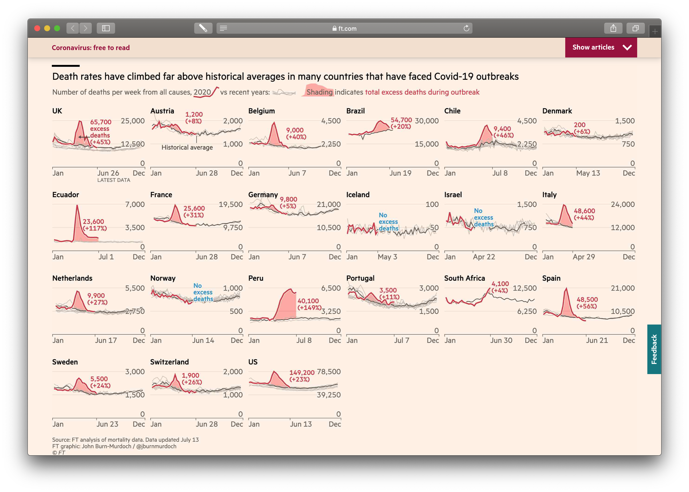
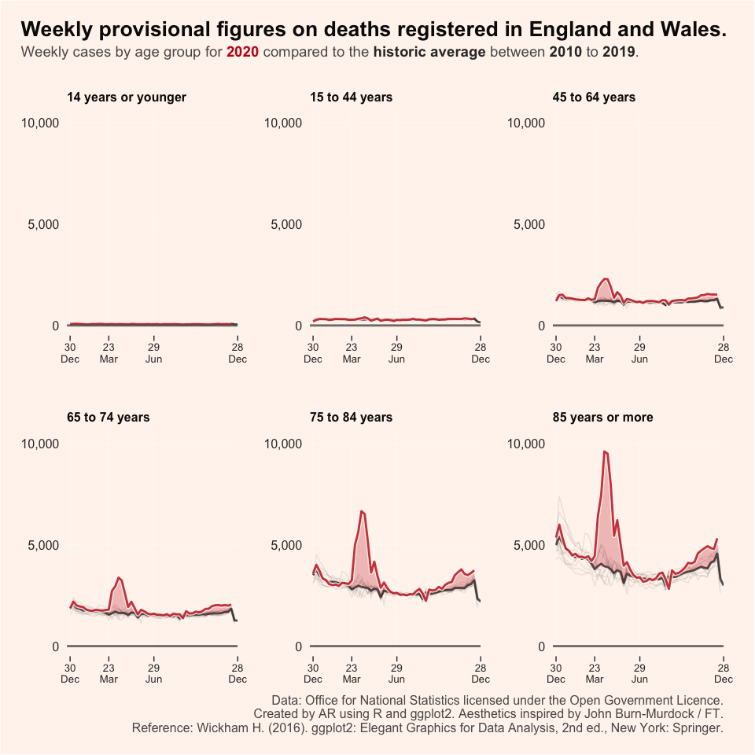

# Using Small Multiples to visualise the effect of the coronavirus pandemic

My first attempts learning **R** and **ggplot2**. The inspiration for this project was the FT analysis of mortality rates by John Burn-Murdock.

Which led to the following chart:

