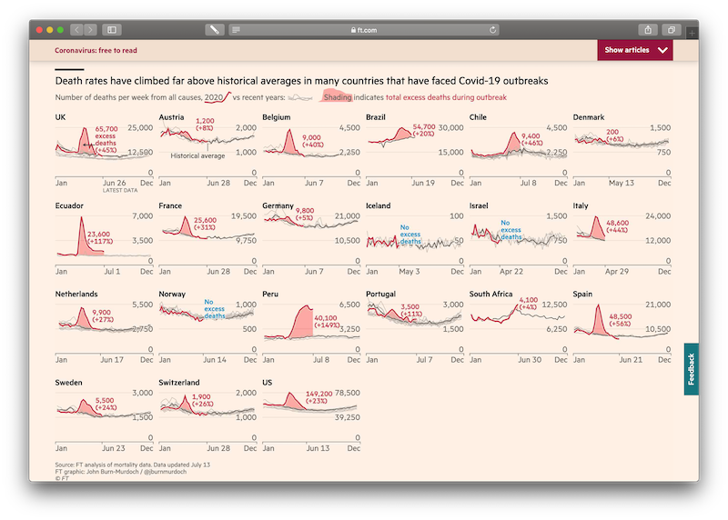

# Using Small Multiples to visualise the effect of the coronavirus pandemic

This repository hosts my first attempts learning **R** and **ggplot2**.

In may 2020, I was scheduled to record [a video](https://methods.sagepub.com/video/using-small-multiples-to-visualize-the-effect-of-the-coronavirus-pandemic) in London that would be published as part of the SAGE [research methods](https://methods.sagepub.com/video/discipline) video series.

When it became evident that a visit to London wouldn't be possible, I had to switch to recording the video at home. On this page, I publish the materials I produced for that tutorial:

1. A [script](Part1--Annotated-Script.md) for the [video](https://methods.sagepub.com/video/using-small-multiples-to-visualize-the-effect-of-the-coronavirus-pandemic) tutorial
   2. A [step-by-step guide](Part2--Supplementary-Materials.md) to create a small multiple in ggplot

The inspiration for this project was the FT analysis of mortality rates by [John Burn-Murdock](https://twitter.com/jburnmurdoch). Back when the pandemic first started, his visualisations encouraged and inspired me to take my mind off of the sad reality and instead spend as much time as possible trying to replicates the graphical style he uses in my own visualisation.

While challenging, it helped me learn ggplot2 ... which has since become my absolute favourite data visualisation tool. My various attempts led to this chart:

